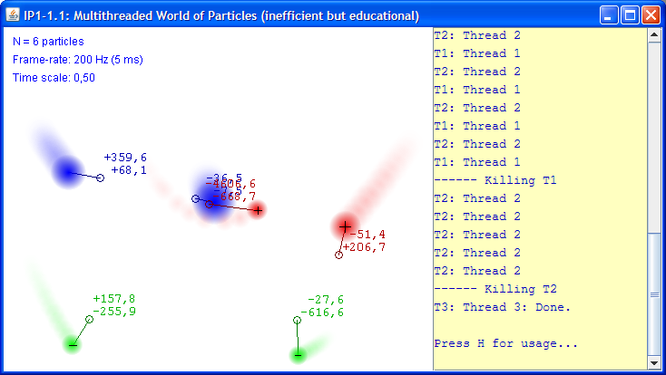

# World of Particles (WoP)

The full documentation is [here](https://mekeetsa.github.io/WoP).

The application displays an artificial world of charged and electrically neutral particles that are governed by physical laws (i.e. electrical and gravitational forces as well Newton's law of motions). This world is referred in the rest of the documentation as the World of Particles or simply the WoP.

The motion for each particle in WoP is calculated in its own separate thread `Particle.run()` belonging to the instance of Particle class. The interacting forces between particles are calculated in `WorldOfParticles.run()` thread common for all particles belonging to the same WorldOfParticles. Instance of the WorldOfParticles is rendered (and animated) inside (as a part of) the JPWorld, which extends JComponent. Particles renders themselves with `Particle.paint()` in the JPWorld's graphical context.

